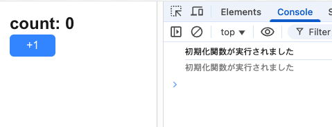
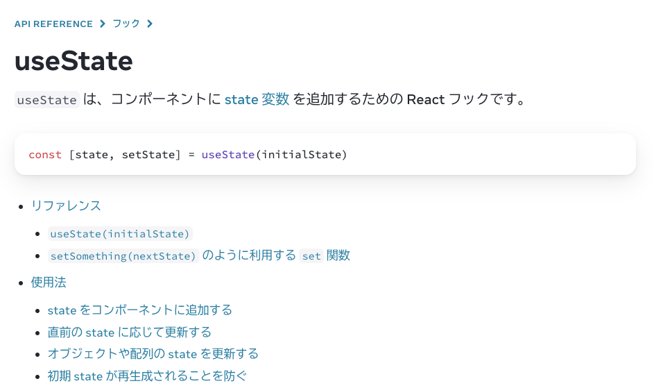

<!--
theme: gaia
_class: lead gaia
-->

# React useState Tips集

スマートキャンプ株式会社
thinceller / Kohei Kawakami

---
<!-- _class: lead -->

# useState、使っていますか？

---

```tsx
"use client";

import { useState } from "react";

const Counter = () => {
  const [count, setCount] = useState(0);

  const handleClick = () => {
    setCount(count + 1)
  };

  return (
    <div className="...">
      <p className="...">count: {count}</p>
      <button onClick={handleClick} className="...">+1</button>
    </div>
  );
};
```

---
<!-- _class: lead -->


---
<!-- _class: lead -->

# 今日はuseStateについて<br>少し詳しくなろう

---
<!-- _class: lead -->

# 今日はuseStateについて<br>少し詳しくなろう

## ≒ useState Tips紹介回

---
<!-- _class: lead gaia -->

# 初期化関数

---

## 初期化関数

- useStateの引数には初期化関数を渡すことができる

```tsx
const [count, setCount] = useState(() => {
  console.log("初期化関数が実行されました"); // 開発時StrictMode下では2回実行される
  return 0;
});
```



---

## 何が嬉しい？

- **初期stateの計算を初回レンダー時のみ実行できる**
  - 通常、Reactコンポーネント上で関数を呼び出すと毎回のレンダーごとに実行されてしまう
  - 初期stateの計算に時間がかかる場合、パフォーマンスに影響を及ぼす可能性がある

---

```tsx
const createInitialState = () => {
  // 5秒くらいかかる処理
  // ...
  return 0;
}

//...
  // 以下のように実装すると各レンダーごとにcreateInitialStateが実行されてしまう👎
  const [count, setCount] = useState(createInitialState());
  // or
  const initialData = createInitialState();
  const [count, setCount] = useState(initialData);

//...
  // createInitialStateは初回レンダー時にしか実行されない👍
  const [count, setCount] = useState(createInitialState);
```

---
<!-- _class: lead gaia -->

# set関数の引数に関数を渡す

---

## set関数の引数に関数を渡す

- set関数（useStateの返り値の2つ目の要素）の引数に関数を渡すことができる
- 関数の引数には前回のstateの値が渡される

```tsx
const [count, setCount] = useState(0);

const handleClick = () => {
  setCount(prev => prev + 1);
}
```

---

## 何が違うの？

- stateはset関数を呼び出したらすぐに更新が反映されるわけではない
  - useStateはstate更新のキューイングみたいなもの

```tsx
const [count, setCount] = useState(0);

const handleClick = () => {
  // count: 0のとき
  // 3回連続でsetCountを呼び出してもcountは2にしかならない
  setCount(count + 1); // 1 + 1 = 2
  setCount(count + 1); // 1 + 1 = 2
  setCount(count + 1); // 1 + 1 = 2
};
```

---

## 何が違うの？

- set関数に渡した更新関数は処理中のstateを引数に受け取る
  - そのため、直前に更新したstateを参照することができる

```tsx
const [count, setCount] = useState(0);

const handleClick = () => {
  // count: 0のとき
  setCount(prev => prev + 1); // 0 + 1 = 1
  setCount(prev => prev + 1); // 1 + 1 = 2
  setCount(prev => prev + 1); // 2 + 1 = 3
  // ちなみに、React 18以降ではイベントハンドラ内のset関数呼び出しをバッチ処理してくれるようになった
};
```

---
<!-- _class: lead gaia -->

# set関数の性質

---

## set関数の性質

- set関数は常に同一であるため、useEffectなどの依存配列に入れる必要はない
  - eslint-plugin-react-hooksはこの性質を考慮してくれるため、依存配列にset関数がなくても警告を出さない

```tsx
const [count, setCount] = useState(0);

const handleClick = () => {
  setCount(prev => prev + 1);
}

useEffect(() => {
  setCount(count + 1);
  handleClick();
}, [count, handleClick]); // setCount関数は常に同一だが、handleClickはレンダーごとに再生成されるため同一ではない
```

---

## 一方、将来的には…

- React Compilerを使うとuseEffectの依存配列は自動で挿入されるようになる
  - from [React Labs: View Transitions, Activity, and more - React](https://react.dev/blog/2025/04/23/react-labs-view-transitions-activity-and-more)
  - 依存配列に気を配らなくて良くなる世界はすぐそこ

```tsx
useEffect(() => {
  setCount(count + 1);
  handleClick();
}); // React Compilerが依存配列を自動で挿入してくれる
```

---
<!-- _class: lead gaia -->

# おわりに

---

- 今日話した内容はすべてReactの公式ドキュメントにわかりやすく日本語で書かれています
  - [useState - React](https://ja.react.dev/reference/react/useState)
  - **公式ドキュメントを読もう！！！**



---
<!-- _class: lead -->

# Thanks!
